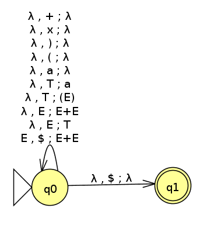

# FOCS Homework 10, for Day 11

You may edit your answers into this file, or add a separate file in the same directory.

If you add a separate file, please include the following at the top:

```
Student Name: Bill Wong
Check one:
[ ] I completed this assignment without assistance or external resources.
[x] I completed this assignment with assistance from ___
   and/or using these external resources: Google
```

## I. Logic

### 1.

The following tables are [truth tables](https://en.wikipedia.org/wiki/Truth_table).

_true_ and _false_ are represented by `T` and `F`. _OR(false, true)_ is commonly written in [infix notation](https://en.wikipedia.org/wiki/Infix_notation): `F OR T`.

The second table shows the value of the function _a OR b_, for all possible values _a_ and _b_. For example, _false OR true_ (the second row) has the value _true_ (the final cell of that row).

_a_ | _b_ | _a_ AND _b_
----|-----|---
 F  |  F  | F
 F  |  T  | F
 T  |  F  | F
 T  |  T  | T

_a_ | _b_ | _a_ OR _b_
----|-----|---
 F  |  F  | F
 F  |  T  | T
 T  |  F  | T
 T  |  T  | T

_a_ | _b_ | _a_ XOR _b_
----|-----|---
 F  |  F  | F
 F  |  T  | T
 T  |  F  | T
 T  |  T  | F

a. Construct the truth table for _a XOR (b XOR a)_.

_a_ | _b_ | _b_ XOR _a_| _a_ XOR (_b_ XOR _a_)
----|-----|------------|------
 F  |  F  | F          | F
 F  |  T  | T          | T
 T  |  F  | T          | F
 T  |  T  | F          | T  


b. Which function corresponds to the English word "or", as used in "You will eat your meat OR you can't have any pudding" (where _a_ = "You will eat your meat" and _b_ = "you can't have any pudding").

XOR

## II. Questions 2–6 are the same as in-class activities 2-6

### 2.

Consider the following context-free grammar G:

```
E -> E + E | T         # <- added "| T"
T -> T x T | (E) | a
```

Convert G to a PDA.



### 3.

Convert grammar G from (2) to Chomsky Normal Form.

```
S0 -> E
E  -> a | EC
T  -> TD | LF
C  -> PE
D  -> XT
F  -> ER
P  -> +
X  -> x
L  -> (
R  -> )
```

### 4.

Is the grammar G's language a regular language? If yes, produce a FSA or regular expression for this language. If not, show this. 

This is not a regular language because (^n a )^n is in the language, but if we pump anything in the string it will not be in the language.

```
((a)) -> ((aa)) # Not in language
((a)) -> (((a)) # Not in language
```

### 5.

Theorem 1: The language {a^n b^n c^n} is not a context-free language.

a. Use Theorem 1, together with the languages {a^i b^i c^j} and {a^i b^j c^j}, to show that the set of context-free languages is not closed under intersection.

{a^i b^i c^j} is a CFL:
```
A → aAb | C
C → cC | e
```

{a^i b^j c^j} is also a CFL:
```
A → aA | B
B → bBc | e
```

The intersection of these two languages is {a^n b^n c^n}, which we know is not a CFL.  Therefore, the set of CFLs is not closed under intersection since the intersection of these two CFLs is not a CFL.

b. Use the pumping lemma for context-free languages [Sipser pp. 125] to prove Theorem 1.

All of the letters in this language have to be equal, so pumping any string will cause an imbalance and make one letter more frequent than the others, thus making it not in the language anymore.

### 6.

Consider the context-free grammar G:

```
S -> NP VP
NP -> NP PP
NP -> DET N
VP -> V NP
VP -> VP PP
DET -> a | the
N -> boy | girl | flowers | binoculars
V -> touches | sees
PP -> P NP
P -> in | from | with
```

a. Show that the string "the girl touches the boy with the flower" has two
different leftmost derivations.

```
S -> NP VP -> DET N VP -> the girl VP -> the girl V NP -> the girl touches NP -> the girl touches NP PP -> the girl touches DET N PP -> the girl touches the boy PP -> the girl touches the boy P NP -> the girl touches the boy with NP -> the girl touches the boy with DET N -> the girl touches the boy with the flower
```
```
S -> NP VP -> DET N VP -> the girl VP -> the girl VP PP -> the girl V NP PP -> the girl touches NP PP -> the girl touches DET N PP -> the girl touches the boy PP -> the girl touches the boy P NP -> the girl touches the boy with NP -> the girl touches the boy with DET N -> the girl touches the boy with the flower
```

b. Describe in English the two different meanings of this sentence.

The girl uses a flower to touch the boy.
The boy has a flower, and the girl touches him.

c. Use G to generate another ambiguous sentence.

`S -> NP VP -> DET N VP -> DET N VP PP -> DET N V NP PP -> DET N V DET N V P NP -> DET N V DET N V P DET N -> a boy sees a girl with binoculars`

d. Modify G so that it generates strings with adjectives: `the girl saw the tall boy`, `the girl touches the boy with a purple flower`.

```
S   -> NP VP
NP  -> NP PP
NP  -> DET N
NP  -> AP N
AP  -> DET A
VP  -> V NP
VP  -> VP PP
DET -> a | the
N   -> boy | girl | flowers | binoculars
V   -> touches | sees
PP  -> P NP
P   -> in | from | with
A   -> tall | purple
```

You don't need to know this, but here's how the variable names relate to linguistics.

Variable | meaning
---|---
S | sentence
DET | determiner (article)
N | noun
NP | noun phrase
P | preposition
PP | prepositional phrase
V | verb
VP | verb phrase

[Adapted from Sipser 2.8.]
